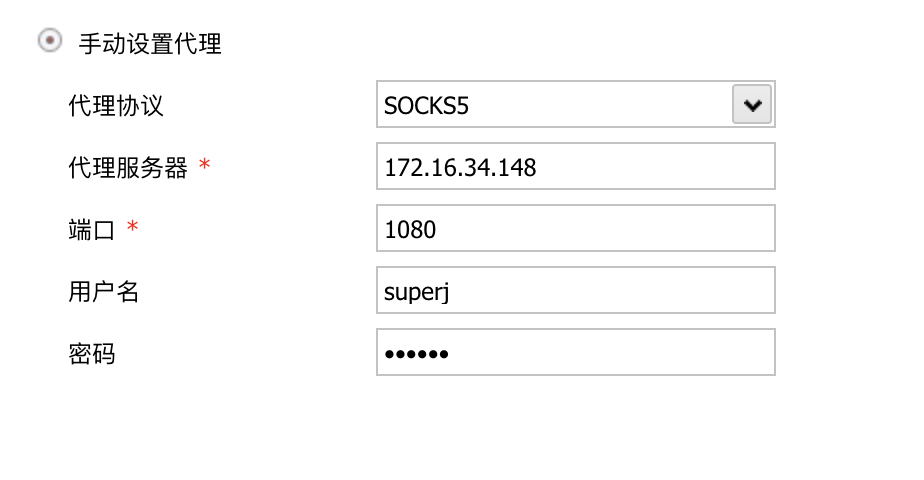
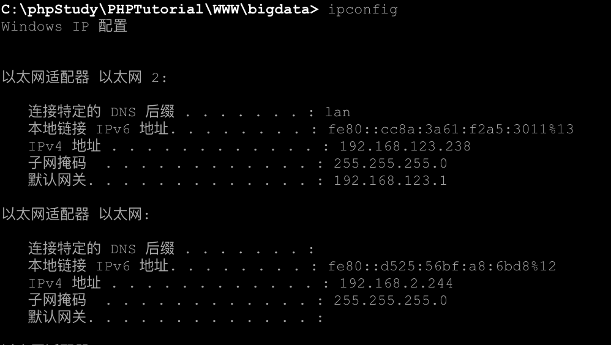

<!-- more -->

# danted-server实现双网卡中内网的访问

## 0x00 背景

### 靶场环境

整个靶场环境在内网环境下。

靶机：`192.168.2.244`

> 2网段下只有一台主机，244双网卡，另一网卡接入互联网。

内网用户：`192.168.3.*`

> 3网段用户通过代理，经过244访问互联网

攻击环境（无Internet访问）：`192.168.4.*`

> 攻击机在4网段，能够针对2网段进行渗透攻击

### 攻击环境（针对一台主机）

在`mac`上安装`kali`虚拟机，因接入攻击网段无法访问互联网，因此虚拟机接入一个无线网卡。kali双网卡，`vmware`提供的`nat`虚拟网卡、无线网卡。

`kali`：

​	`192.168.4.78`：访问靶机。

​	`172.16.34.148`：与物理机进行通信。

## 0x01 为何利用danted-server

主要原因是`蚁剑`之前已经安装在`mac`上，不想在`kali`上再装一遍。因此想通过`socks5`代理实现物理机`蚁剑`能够连接靶机`webshell`。

## 0x02 kali服务端配置

### 安装danted-server

1. 安装

```shell
apt-get install danted-server
```

2. 配置

创建用户。

```shell
useradd superj
passwd superj
```

首先备份/etc/danted.conf。

```shell
rm /etc/danted.conf /etc/danted.conf_old
```

创建/etc/danted.conf，并写入。

```shell
vim /etc/danted.conf
```

```shell
logoutput: /var/log/danted.log
internal: 172.16.34.148(与物理机进行通信的网卡) port = 1080
external: 192.168.4.78(与靶机进行通信的网卡)
method: username  #none
user.privileged: root
user.notprivileged: superj(自己创建的用户)
user.libwrap: nobody
client pass {
from: 0.0.0.0/0 to: 0.0.0.0/0
log: connect disconnect
}
pass {
        from: 0.0.0.0/0 to: 0.0.0.0/0
        command: bind connect udpassociate
        log: error # connect disconnect iooperation
        method: username
}
block {
from: 0.0.0.0/0 to: 0.0.0.0/0
log: connect error

}
```

启动danted服务。

```shell
/etc/init.d/danted start
```

## 0x03 蚁剑配置

蚁剑配置代理。



## 0x04 结果

成功打开webshell。



## 0x05 思考

通过这次的配置，感觉可以在靶机上也通过这次的代理方式实现对3网段的攻击。

