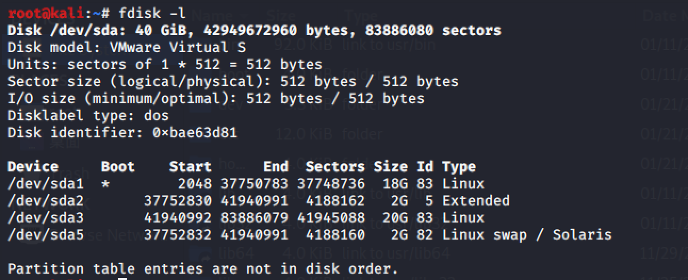
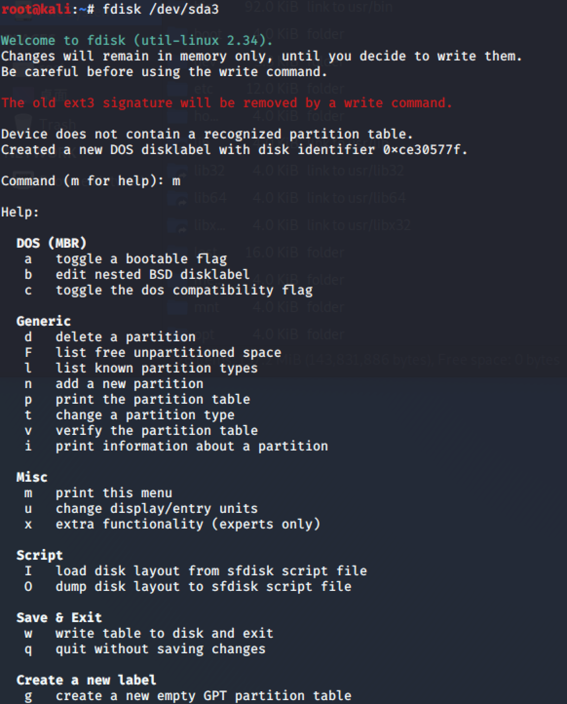
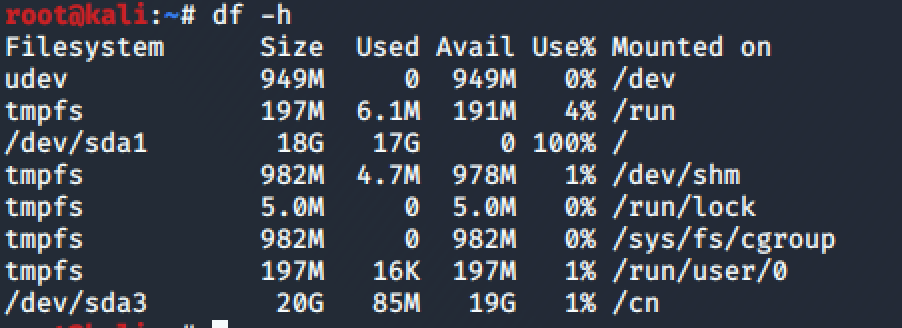

<!-- more -->

# 0x00 遇到问题

在安装虚拟机时分配了20G的空间，但在使用的过程中，20G的空间被占满，在apt安装软件时出现了错误。提示`/var/cache/apt/archives`空间太小，导致了无法安装软件。

# 0x01 解决方法

1. 首先关闭虚拟机

2. 清除所有的快照

3. 在虚拟机软件中调整分配给该虚拟机的硬盘大小

   

4. 打开虚拟机

   - 查看磁盘

     `fdisk -l`发现新添加的磁盘`/dev/sda3`。

     

   - 进入磁盘的菜单项，增加分区。

     `fdisk /dev/sda3`

     

     在磁盘管理的菜单中，`n`进行添加分区，选择`e`添加扩展分区，`w`将更改写入磁盘。

   - 格式化分区

     `mkfs.ext3 /dev/sda3`

   - 在根目录下创建新的目录，并将新建分区挂载该目录下

     `mkdir cn`

     `mount /dev/sda3 /cn`

   - 查看挂载情况

     `df -h`

     

     发现新增加的磁盘已经挂在在了`/cn`下。

   - 在新的目录下创建一个目录，然后把`/var/cache/apt/archives`换成指向那个目录的软连接

     `mkdir -p /cn/debs/partial`

     `rm -rf /var/cache/apt/archives`

     `ln -s /cn/debs /var/cache/apt/archives`

# 0x02 总结

经过以上的操作可以解决磁盘空间不够导致的apt安装时提示空闲空间不够的问题。

该解决方法必须在`root`权限下进行操作。

目前对`Linux`的磁盘管理方面的知识还不是很完善，之后加强对linux磁盘管理的学习。		

