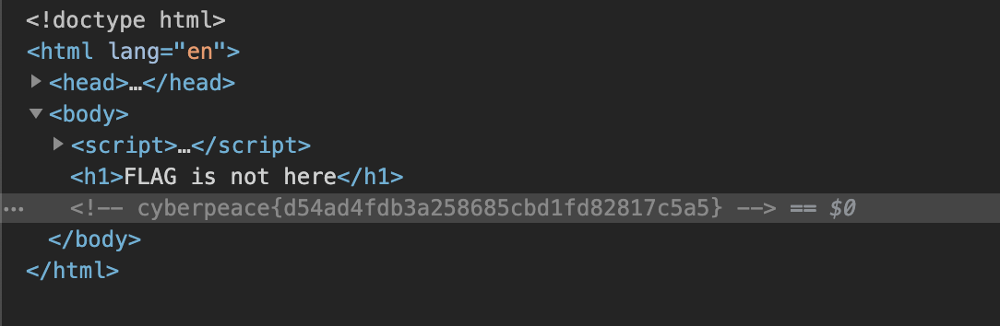
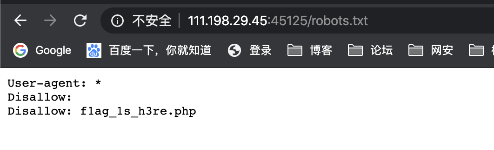
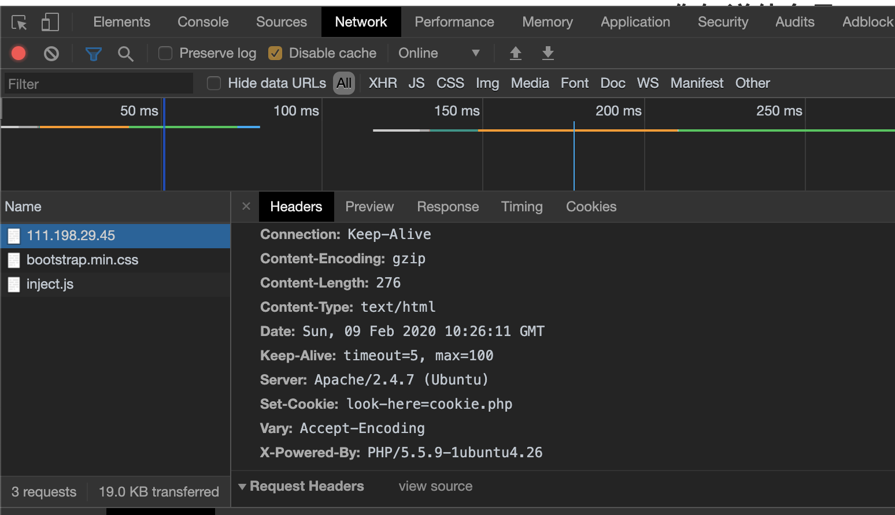
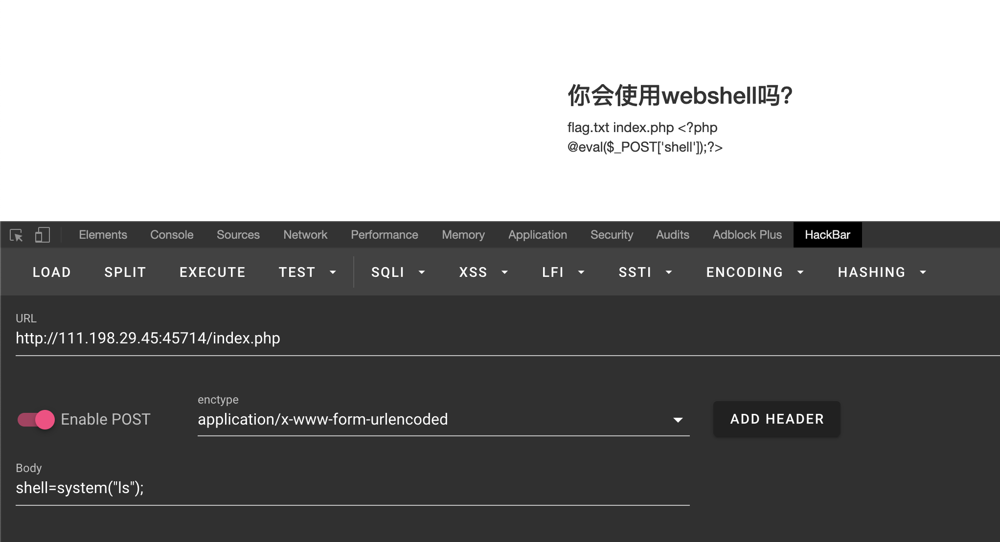
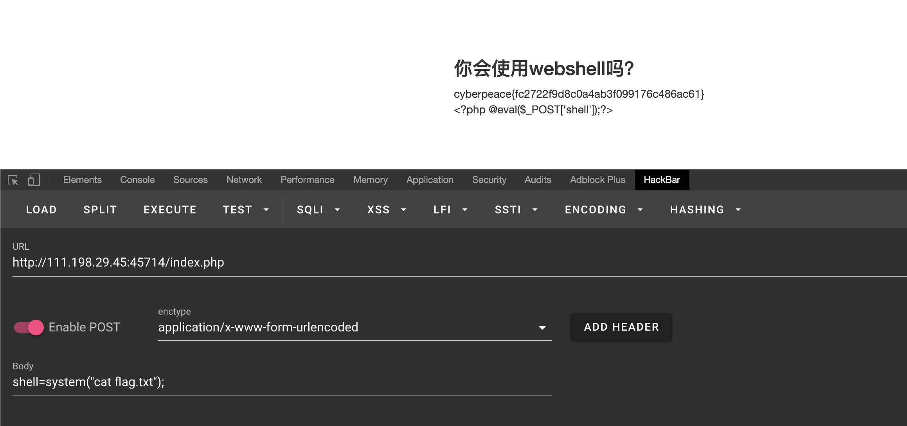
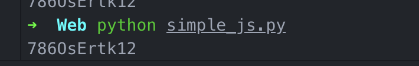

# 0x00 view_source

题目描述：X老师让小宁同学查看一个网页的源代码，但小宁同学发现鼠标右键好像不管用了。



直接打开网站，`F12`查看源代码，发现`flag`：`cyberpeace{d54ad4fdb3a258685cbd1fd82817c5a5}`。

# 0x01 robots

题目描述：X老师上课讲了Robots协议，小宁同学却上课打了瞌睡，赶紧来教教小宁Robots协议是什么吧。

分析描述，可以知道存在`robots.txt`文件，打开发现



可知道有文件`flag_ls_h3re.php`，直接打开该文件得到`flag`：`cyberpeace{165ec629b3fbc11e0b229a9a3c7283a6}`。

# 0x02 backup

题目描述：X老师忘记删除备份文件，他派小宁同学去把备份文件找出来,一起来帮小宁同学吧！

分析描述：php的备份文件有两种：`*.php~`和`*.php.bak`。

分别打开这两个文件，可以下载到`index.php.bak`文件，打开找到`flag`。

```php+HTML
<html>
<head>
    <meta charset="UTF-8">
    <title>备份文件</title>
    <link href="http://libs.baidu.com/bootstrap/3.0.3/css/bootstrap.min.css" rel="stylesheet" />
    <style>
        body{
            margin-left:auto;
            margin-right:auto;
            margin-TOP:200PX;
            width:20em;
        }
    </style>
</head>
<body>
<h3>你知道index.php的备份文件名吗？</h3>
<?php
$flag="Cyberpeace{855A1C4B3401294CB6604CCC98BDE334}"
?>
</body>
</html>

```

# 0x03 cookie

题目描述：X老师告诉小宁他在cookie里放了些东西，小宁疑惑地想：‘这是夹心饼干的意思吗？’

分析描述，发现这道题目是要找cookie。访问靶机，`F12`在network中查看`response`头。



发现`Set-Cookie: look-here=cookie.php`，因此我们访问`cookie.php`。让我们查看`response`。找到`flag`：`cyberpeace{1b0103c4937fa3d11fc2d535cd5836bd}`。

# 0x04 disabled_button

题目描述：X老师今天上课讲了前端知识，然后给了大家一个不能按的按钮，小宁惊奇地发现这个按钮按不下去，到底怎么才能按下去呢？

打开目标网页，`f12`打开源代码发现：

```html
<input disabled="" class="btn btn-default" style="height:50px;width:200px;" type="submit" value="flag" name="auth">
```

将disabled属性删除后，发现按钮可以点击，获取`flag`：`cyberpeace{6c7f92cbdd9571b6cf10ffb26846022f}`。

# 0x05 weak_auth

题目描述：小宁写了一个登陆验证页面，随手就设了一个密码。

打开网页，发现是一个登录页面，结合描述，认为是弱口令。

```python
# 第一次测试
username = 111
password = 111
# 返回信息：please login as admin

#第二次测试
username = admin
password = admin
# 返回信息：password error
```

现在，我们可以确定账户为`admin`。

现在我们可以通过弱口令工具爆破该密码。

[WebCrack](https://github.com/yzddmr6/WebCrack)

具体的使用方法该工具的`README.md`中有，这里不再赘述。

跑出来，发现账号密码为：`admin/123456`。登录，得到`flag：cyberpeace{10d2ccedf1e3b82ef0e773e776e81386}`。

# 0x06 simple_php

题目描述：小宁听说php是最好的语言,于是她简单学习之后写了几行php代码。

打开网页发现php源码，`$a`和`$b`是通过`$_GET[]`得到的，所以可以在url中构造参数。

分析该题是php弱类型比较，`a==0`返回真，输出`$flag1`,`4444a`绕过`is_numeric`，并且大于1234，输出`$flag2`，得到`flag:Cyberpeace{647E37C7627CC3E4019EC69324F66C7C}`。

# 0x07 get_post

题目描述：X老师告诉小宁同学HTTP通常使用两种请求方法，你知道是哪两种吗？

首先，明白两种提交方式：GET和POST。

GET方法提交时，参数会直接跟在url后面，例如：`www.xxx.com/?a=1&b=2&c=3`各参数用`&`连接。

POST方法提交时，参数不会出现在url中，而是会以键值对的方式跟在请求头后面。

打开网页，提示以GET方式提交变量a，值为1，因此在url后添加`?a=1`。之后提示以POST请求提交变量b，值为2，这时通过chrome插件`hackbar`以POST方式提交b=2的请求，获取`flag：cyberpeace{dbbf28d1d2855295e7e749e836df3f6e}`。

# 0x08 xff_referer

题目描述：X老师告诉小宁其实xff和referer是可以伪造的。

首先要明白xff和referer。

xff：x-forwarded-for，用来识别通过HTTP代理或负载均衡方式连接到Web服务器的客户端最原始的IP地址的HTTP请求头字段。

referer：告诉服务器该网页是从哪个页面链接过来的。

打开网页，提示IP地址必须为123.123.123.123，因此在请求头中添加x-forwarded-for:123.123.123.123。提交请求，提示必须来自`https://www.google.com`，因此请求头中添加referee：`https://www.google.com`，得到`flag：cyberpeace{b6aaf4c55f9cf5644e135c3b47a2f8d7}`。

本题通过chrome插件`modheader`实现对http header的修改。

# 0x09 webshell

题目描述：小宁百度了php一句话,觉着很有意思,并且把它放在index.php里。

由题目可知，已经有了一句话木马了，现在只需要会连接就可以。

可以用[蚁剑](https://github.com/AntSwordProject)连接，这里不介绍具体用法。

我们这里用chrome插件`hackbar`提交POST请求获取flag。





`flag:cyberpeace{fc2722f9d8c0a4ab3f099176c486ac61}`

# 0x10 command_execution

题目描述：小宁写了个ping功能,但没有写waf,X老师告诉她这是非常危险的，你知道为什么吗。

打开网页发现可以直接执行命令，通过`;`可以执行多个命令。

```shell
# 首先找到flag.txt文件的位置
;find / -name flag.txt
# 返回：/home/flag.txt

# 查看flag.txt内容
;cat /home/flag.txt
# 返回：cyberpeace{f48d4d8ec8bc8697ab114c130789493f}
```

# 0x11 simple_js

题目描述：小宁发现了一个网页，但却一直输不对密码。(Flag格式为 Cyberpeace{xxxxxxxxx} )

打开网页，`F12`打开源码，发现js源码。

```js
function dechiffre(pass_enc){
    var pass = "70,65,85,88,32,80,65,83,83,87,79,82,68,32,72,65,72,65";
    var tab  = pass_enc.split(',');
    var tab2 = pass.split(',');
    var i,j,k,l=0,m,n,o,p = "";
    i = 0;
    j = tab.length;
    k = j + (l) + (n=0);
    n = tab2.length;
    for(i = (o=0); i < (k = j = n); i++ ){
        o = tab[i-l];
        p += String.fromCharCode((o = tab2[i]));
        if(i == 5)
            break;
    }
    for(i = (o=0); i < (k = j = n); i++ ){
        o = tab[i-l];
        if(i > 5 && i < k-1)
            p += String.fromCharCode((o = tab2[i]));
    }
    p += String.fromCharCode(tab2[17]); 
    pass = p;return pass;
}
String["fromCharCode"](dechiffre("\x35\x35\x2c\x35\x36\x2c\x35\x34\x2c\x37\x39\x2c\x31\x31\x35\x2c\x36\x39\x2c\x31\x31\x34\x2c\x31\x31\x36\x2c\x31\x30\x37\x2c\x34\x39\x2c\x35\x30"));
h = window.prompt('Enter password');
alert( dechiffre(h) );

```

该题为js代码审计，简化上面的代码可得：

```js
function dechiffre(pass_enc){
    var pass = "70,65,85,88,32,80,65,83,83,87,79,82,68,32,72,65,72,65";
    var tab  = pass_enc.split(',');
    var tab2 = pass.split(',');
    var i,j,k,l=0,m,n,o,p = "";
    i = 0;
    n = tab2.length;
    for(i = 0; i < n; i++ ){
        p += String.fromCharCode(tab2[i]);
    }
    p += String.fromCharCode(tab2[17]); 
    pass = p;return pass;
}
String["fromCharCode"](dechiffre("\x35\x35\x2c\x35\x36\x2c\x35\x34\x2c\x37\x39\x2c\x31\x31\x35\x2c\x36\x39\x2c\x31\x31\x34\x2c\x31\x31\x36\x2c\x31\x30\x37\x2c\x34\x39\x2c\x35\x30"));
h = window.prompt('Enter password');
alert( dechiffre(h) );

```

可以发现无论输入什么，最后返回的值永远都是tab2，也就是pass处理后的值，而真正的flag是`\x35\x35\x2c\x35\x36\x2c\x35\x34\x2c\x37\x39\x2c\x31\x31\x35\x2c\x36\x39\x2c\x31\x31\x34\x2c\x31\x31\x36\x2c\x31\x30\x37\x2c\x34\x39\x2c\x35\x30`。通过脚本跑出`flag`。

```python
a = '\x35\x35\x2c\x35\x36\x2c\x35\x34\x2c\x37\x39\x2c\x31\x31\x35\x2c\x36\x39\x2c\x31\x31\x34\x2c\x31\x31\x36\x2c\x31\x30\x37\x2c\x34\x39\x2c\x35\x30'
# print(a)
flag = ''
a = a.split(',')
for i in a:
    flag += chr(int(i))


print(flag)

```



`flag：Cyberpeace{786OsErtk12}`

# 后记

若有web大佬看见，有任何建议都可以相互交流一下，江小白在这里拜谢。