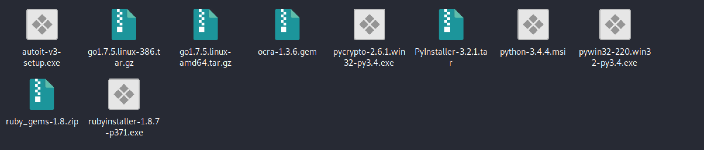
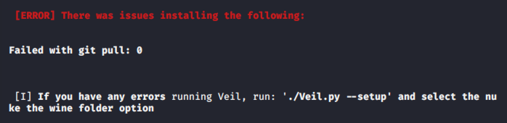

<!-- more -->

# 解决Veil—Evasion安装中git clone导致失败的问题

## 0x00 原因

因为`git clone`在国内下载过慢的原因，在`Veil`安装时，下载依赖不成功导致安装失败。

因此，找到了一下详细的办法。

## 0x01 kali下安装Veil

kali下安装只需要一行命令。

`apt-get install veil-evasion`

## 0x02 下载依赖

首先在以下地址下载`VeilDependencies1.zip`和`VeilDependencies2.zip`。

[下载地址](https://download.csdn.net/user/weixin_43713800/uploads)

[^注]: 因上传大小限制才上传两次。

下载完成后将两个安装包分别都解压。解压后为10个文件。

在`/var/lib/veil/`下创建文件夹`setup-dependencies`，并将以上文件拷贝到该文件夹下。

> 若以上方法还出现问题，则在`siteup-dependencies`下再创建文件夹`VeilDenpendencies`，并将以上文件复制到该文件夹下再试。

## 0x02 更改setup.sh

到路径`/usr/share/veil/config/`下通过`vim`打开`setup.sh`，在248行找到一下代码，将其注释。

```shell
echo -e " [*] ${YELLOW}Empty folder... git cloning${RESET}\n"
sudo mkdir -p "${dependenciesdir}"
sudo rm -rf "${dependenciesdir}"
sudo git clone https://github.com/Veil-Framework/VeilDependencies.git "${dependenciesdir}"
```

并在这几行代码向上16行左右的位置找到`rm -rf "${dependenciesdir}"`，并将其注释。

```shell
 [ "${force}" == "true" ] # && rm -rf "${dependenciesdir}"

```

## 0x03 执行安装

`./setup.sh --force --silent`



看到上图，表示安装成功，唯一的错误是因为手动下载依赖导致，无关紧要。