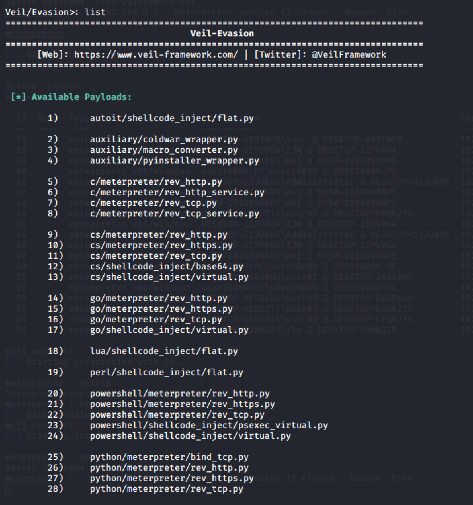
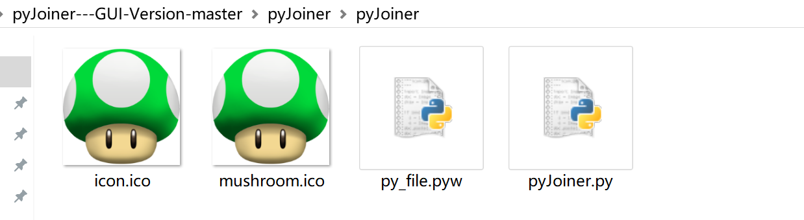
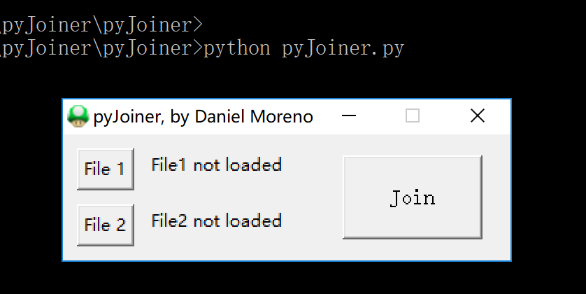
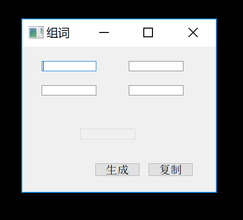
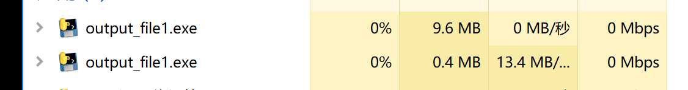
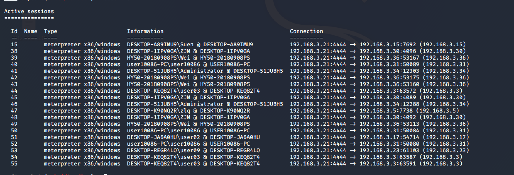
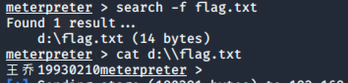
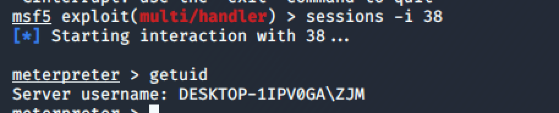
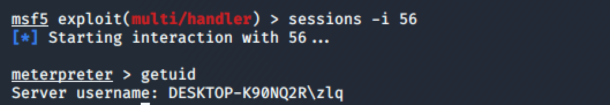

# 记一次小小的社工行动

## 背景

随着一个多月的时间，实验室渗透测试的任务随着A组大佬打通关，从远程的渗透工作也算是有了一个比较完美的结束。收集到了扫描、攻击等信息。为了丰富收集的攻击数据的完整性，因此随后开展了在3网段的社工攻击，以丰富收集到的攻击数据，为之后的知识图谱的构建打好基础。

## 技术手段

主要技术

|   **技术**   | 描述                                                         |
| :----------: | ------------------------------------------------------------ |
| veil-evasion | 一个生成木马工具，有着不少的payload和生成方式使用。          |
|   pyjoiner   | github上一个开源的项目，用以进行两个exe文件的捆绑，对后门木马进行一定的伪装，在传播过程中，减少被发现几率。 |

### veil-evasion

Veil Evasion是一个可执行文件，它被用来生成Metasploit的payload，能绕过常见杀软。

Veil-Evasion被原生设计为在kali上，但其实存在python环境的系统上应该都能运行。你可以用命令行轻松调用Veil-Evasion，按菜单选项生成payload。在创建payload的时候，Veil-Evasion会询问你是否想把payload文件用Pyinstaller或者Py2Exe转为可执行文件。



在本次前期的渗透过程中，我们尝试的29号payload`python/shellcode_inject/aes_encrypt.py`的免杀效果最好，因此在本次的社工，通过邮件、布谷鸟扩散的后门木马就使用这个。在实际的测试当中，发现在win10中的效果也是不错的。

下面贴出生成命令：

```shell
# 打开veil
veil

# 选择evasion
use 1

# 选择29号payload
use 29

# 使用python加密
set USE_PYTHON Y

# 开始生成
generate

# 选择msfvenom
use 2
```

之后一路回车，中间填写输出文件名、监听IP地址、监听端口。

### pyjoiner

是一个`github`上的开源项目，地址为

[pyjoiner]: https://github.com/danielhnmoreno

有两个版本，一个是32位kali的版本，另一个是win下的带图形界面的版本。

在这里我们选择win下的版本。

> windows版本：windows 10
>
> python版本： 3.4.4
>
> pyinstaller版本： 3.3.1

以上是本次pyjoiner的运行环境。



down下来`pyjoiner`后，打开文件夹，在该位置下打开`cmd`运行`python pyJoiner.py`，出现图形化界面。



傻瓜式操作选择被捆绑程序和后门程序。这里我们选取了自写的一个qt程序和veil生成的后门。


运行后：






发现在后台启动了两个进程，分别为被捆绑的正常软件和后门程序。实现了对后门的隐藏。

> 之后想到了更加好的隐藏办法，将后门捆绑在windows自带的小游戏下，这样的隐藏效果会更好。

## 开始攻击

将事先准备好的`小蘑菇.exe`通过布谷鸟和邮件的方式进行在内网下的传播，并在`kali`上开启监听。



最后的效果很好，反弹回了一堆`session`，其中挑几个，查看其中flag和getuid。







## 总结

在这次的社工中，主要的目的针对了对传播木马的伪造效果，对社工的具体的利用方式还有待加强，没有达到一个正真的外部人员对一个内网用户真实的社工状态，这可能跟我们本来就是内部人员有关吧:joy:。希望各位大佬能够给予一些建议:innocent:。